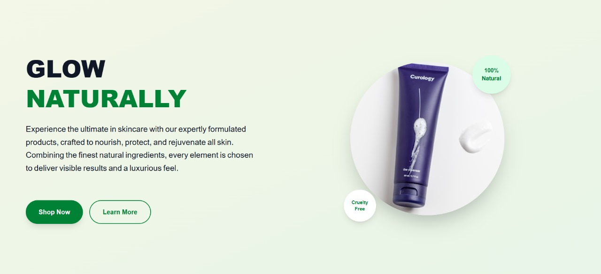
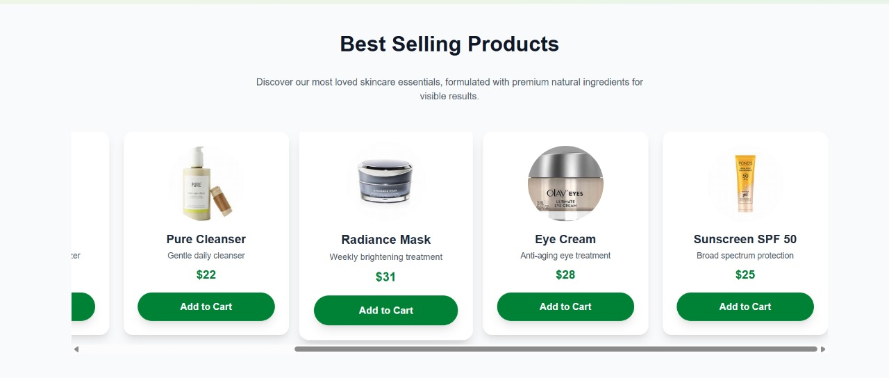
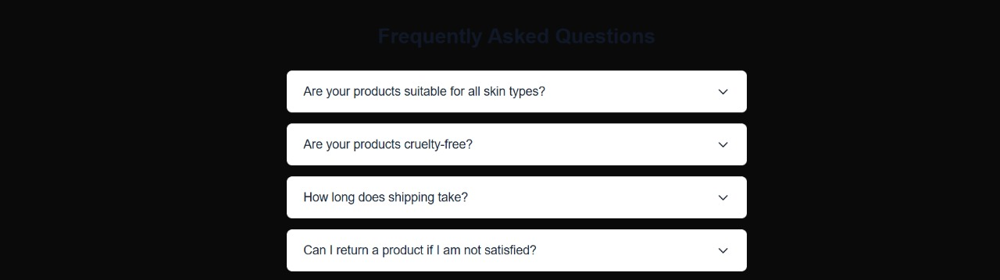

# Six Landing Page

A modern, fully responsive skincare landing page built with **Next.js**, **React**, and **Tailwind CSS**.  
This project demonstrates premium UI/UX, smooth animations, and a clean, maintainable codebase for a real-world product landing page.

---

## 🚀 Live Demo

[View the deployed site on Vercel](https://six-landing-h3ci.vercel.app/)

---

## 📸 Screenshots

### Hero Section


### Best Selling Products


### FAQ Section


---

## ✨ Features

- **Fully Responsive:** Looks great on mobile, tablet, and desktop.
- **Animated Loader:** Elegant page load animation for a premium feel.
- **Hero Section:** Eye-catching headline, animated text, and call-to-action buttons.
- **Animated Text Reveal:** The first paragraph animates word-by-word on load.
- **Best Sellers Slider:** Interactive, tactile product slider with real skincare product images and animated buttons.
- **FAQ Section:** Expand/collapse with smooth, accessible animations.
- **Modern UI:** Uses Tailwind CSS for rapid, maintainable styling.
- **Clean Codebase:** Modular React components, TypeScript, and best practices.

---

## 🗂️ Project Structure

```
six-landing/
│
├── public/                # Static assets (SVGs, favicon, etc.)
├── screenshots/           # Screenshots for documentation
├── src/
│   ├── app/
│   │   ├── layout.tsx     # Root layout and global styles
│   │   ├── page.tsx       # Main landing page
│   │   ├── globals.css    # Tailwind and custom global styles
│   │   └── favicon.ico
│   └── components/
│       ├── Loader.tsx         # Animated loader
│       ├── LandingHero.tsx    # Hero section with animated text
│       ├── AnimatedText.tsx   # Word-by-word text animation
│       ├── BestSellers.tsx    # Product slider
│       └── FAQ.tsx            # FAQ section
├── package.json
├── tsconfig.json
├── postcss.config.mjs
├── eslint.config.mjs
├── README.md
└── ... (other config files)
```

---

## 🛠️ Tech Stack

- [Next.js](https://nextjs.org/) (App Router)
- [React](https://react.dev/)
- [Tailwind CSS](https://tailwindcss.com/)
- [TypeScript](https://www.typescriptlang.org/)
- [GSAP](https://gsap.com/) (for advanced animation, if enabled)
- [ESLint](https://eslint.org/) (code quality)
- [PostCSS](https://postcss.org/) (with Tailwind plugin)

---

## 🧑‍💻 Getting Started

### 1. Clone the repository
```bash
git clone https://github.com/MILI-5/six-landing.git
cd six-landing
```

### 2. Install dependencies
```bash
npm install
# or
yarn install
```

### 3. Run the development server
```bash
npm run dev
# or
yarn dev
```
Open [http://localhost:3000](http://localhost:3000) to view the site.

---

## 🏗️ Build & Deploy

### Build for production
```bash
npm run build
```

### Start production server
```bash
npm start
```

### Deploy on Vercel
- Import your repo at [vercel.com/import](https://vercel.com/import)
- Set the root directory to `/` (project root)
- Vercel auto-detects Next.js and deploys your site

---

## 📝 Customization

- **Add/replace product images:** Edit the `products` array in `src/components/BestSellers.tsx`.
- **Edit FAQ:** Update the `faqs` array in `src/components/FAQ.tsx`.
- **Change hero text:** Edit `src/components/LandingHero.tsx`.
- **Global styles:** Edit `src/app/globals.css` and Tailwind config.

---

## 📦 Scripts

- `npm run dev` – Start development server
- `npm run build` – Build for production
- `npm start` – Start production server
- `npm run lint` – Run ESLint

---

## 🤝 Contributing

Pull requests are welcome! For major changes, please open an issue first to discuss what you would like to change.

---

## 📄 License

This project is open source and available under the [MIT License](LICENSE).

---

If you need further customization or want to add more documentation, let me know!
